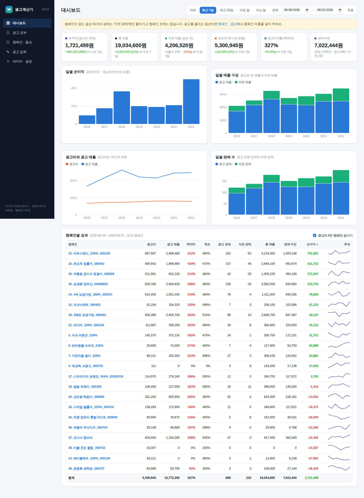

# 쿠팡 광고계산기

쿠팡 판매자센터의 **어제 판매 데이터**와 광고센터의 **어제 광고 데이터**를 모아
캠페인별·일자별 **광고 장부**(광고수익률, CPC, 광고 마진, 순이익 …)를 자동 계산합니다.

## 🟢 초보자는 여기만 보세요 — 크롬 확장 프로그램

프로그램 설치, 서버, 터미널 **필요 없음**. 크롬에 `extension` 폴더를 확장 프로그램으로 넣으면 끝입니다.

👉 **[초보자 가이드 (설치 5분, 매일 1분)](docs/초보자_가이드.md)**

매일 하는 일: 판매분석 → 어제 화면에서 **① 판매 데이터 저장**(상품별 판매 리포트를 받아 읽음), 광고 관리 → 매출 성장 → 어제 화면에서 **② 광고 데이터 저장**.
직접 받은 리포트 엑셀은 **📂 리포트 파일 올리기** 로 올리면 됩니다.
장부는 확장 아이콘 → **📒 장부 보기** 에서 봅니다. 마진이 바뀌면 적용 시작일과 함께 넣으면 그 날부터만 적용됩니다.



---

## 버전 기록 (확장 프로그램)
팝업과 장부 화면의 제목 옆에 현재 버전이 표시됩니다. 새 버전이 나오면 팝업에 알림이 뜹니다. **extension 폴더 안의 업데이트.bat** 을 더블클릭하면 최신 파일로 바뀌고 확장 프로그램이 스스로 새로고침됩니다 (ZIP 을 다시 받을 필요 없음).

| 버전 | 내용 |
|---|---|
| **v0.23.0** | 광고 장부에 목표·예산만 있고 광고비·노출·클릭이 0으로 저장되던 문제: 광고센터가 목록을 먼저 그리고 성과 숫자를 뒤에 채우는데 그 전에 읽었음 → 성과 숫자가 들어오고 3초 간격 두 번 읽은 값이 같아질 때까지 기다림. 모두 0이면 저장하지 않음. 이미 있는 숫자는 0으로 덮어쓰지 않음(설정값만 갱신). 여러 쪽을 끝까지 못 읽었으면 한 번 더 읽음. |
| v0.22.2 | 자동 수집 판매 저장 확인("window.open 로 받은 … 판매 119건 저장"). 같은 리포트 주소가 잇달아 두 번 잡히면 한 번만 받음. |
| v0.22.1 | 가로챈 리포트 주소가 `/fcc/download-manager/…` 같은 상대 주소여서 "Invalid URL" 로 실패하던 것 수정(절대 주소로 변환). 광고 저장 기록에 읽은 쪽수 표시. |
| v0.22.0 | 자동 수집(판매): 확장이 연 창에는 사용자 클릭이 없어 리포트를 새 창으로 여는 다운로드가 팝업 차단에 걸림 → 페이지에 훅을 심어 새 창 주소를 가로채 확장이 직접 받아 저장. 자동 수집(광고): 화면 기간이 어제 하루가 아니면(다른 날·여러 날 합계) '어제' 를 다시 누르고, 그래도 아니면 저장하지 않음(엉뚱한 날짜로 저장되던 문제). |
| v0.21.0 | 자동 수집이 배경 탭에서 실패하는 원인 대응: 크롬은 보이지 않는 탭의 화면을 그리지 않아 광고 표가 비고 다운로드가 시작되지 않음 → 기본으로 <b>작은 창을 따로 띄워</b> 수집하고 끝나면 닫음(설정에서 끌 수 있음). 판매 다운로드는 30초 안에 안 오면 한 번 더 누름. 실패 기록에 그때 화면 상태(제목·글자 수·캠페인/다운로드 글자 유무)를 남김. |
| v0.20.0 | 자동 수집 실패 원인 수정: 광고 관리 주소가 도메인만(https://advertising.coupang.com/)으로 저장돼 있으면 기본 목록 주소로 자동 복구. 백그라운드 탭에서 화면이 늦게 떠도 최대 45초 더 기다리며 다시 읽고, 광고는 모든 페이지를 읽음. 판매는 다운로드 버튼을 3번까지 다시 찾음. 설정 주소 옆에 <b>기본 주소로</b>·<b>시험</b> 버튼(그 주소를 열어 표/다운로드 버튼을 찾는지 확인). '어제' 버튼을 기간 선택기를 열어서도 찾음. |
| v0.19.1 | 자동 수집 칸 안으로 <b>날짜를 정해 가져오기(시작~끝)</b> 를 옮김. 대기(초)·빠진 날 보충의 뜻을 화면에 설명. |
| v0.19.0 | 장부의 반품·취소 수를 빠져나간 수답게 -1 처럼 표시. 자동 수집에 <b>특정 날짜 수집</b>, 지난 날짜 채우기에 빠른 선택(어제·3·7·14·30일, 마지막 저장 다음 날~어제). 고른 날짜와 화면의 날짜가 다르면 저장하지 않고 알림. |
| v0.18.0 | 판매 리포트의 '총 판매수'·'총 취소된 상품수' 열을 그대로 읽음(취소는 음수로 오므로 절댓값). 자연 판매 수 = 총 판매 수 − 광고 전환 판매 수 로 같은 기준끼리 비교. 장부에 '총 판매 수' 항목 추가(기본 꺼짐), 판매 수 줄 이름에 뜻 설명 툴팁. |
| v0.17.0 | 대시보드에 **🔎 데이터 점검**(최근 14일 저장 상태와 '왜 안 보이는지' 안내). 저장 데이터가 보는 기간보다 뒤 날짜면 자동으로 그 날까지 보기, 광고비 0원 저장·마진 없는 판매 경고. 자동 수집 상태(켜짐/다음 예정/마지막 실행) 표시, 크롬이 꺼져 놓친 날은 켠 뒤 따라잡기. |
| v0.16.1 | 트래픽 효과 탭을 데이터·설정 위로 옮기고 '트래픽 켠 뒤 자연 매출이 늘었는지' 한 문장으로 요약. |
| v0.16.0 | 트래픽 효과 탭 신설, 지출 사유에 택배·인증 추가, 광고 장부 기본 표시에 노출수·클릭률·전환율. |
| v0.15.0 | 캠페인별 트래픽 슬롯 입력과 장부·대시보드 표시. |
| v0.14.4 | 광고 장부 위쪽에도 가로 스크롤바, 열 때 가장 최근 날짜로 이동. |
| v0.14.3 | 장부 맨 위 줄을 '전체 순이익' 하나로 (광고비·광고 외 지출 모두 차감). |
| v0.14.1 | 판매 수 줄을 광고 전환 판매 수 → 자연 판매 수 → 반품·취소 수 → 실제 판매 수 순으로. 반품·취소 수 = 리포트에 열이 있으면 그 합, 없으면 광고 전환 판매 수가 실제 판매 수를 넘는 만큼. |
| v0.14.0 | 판매 리포트에 반품·취소 열이 있으면 읽음. 가져온 파일의 열 이름을 기록에 남김. 광고 장부 표를 내용 폭만큼만 써 캠페인 칸이 늘어나지 않게. |
| v0.13.4 | 광고센터 표의 '종료일' 열을 날짜 열로 오인해 캠페인이 종료일 날짜로 저장되던 문제 수정(날짜 열은 날짜/일자/기준일만, 종료·시작·등록 등 제외). 업데이트 시 잘못 저장된 광고 행 1회 정리. |
| v0.13.3 | 광고센터 캠페인 목록(react-table) 전용 인식기, 인식기별 예외 격리·오류 표시. |
| v0.13.2 | ①: 판매분석 필터 줄을 표로 오인하던 문제 수정(옵션ID 헤더 필요), 행이 없으면 리포트 다운로드로 자동 전환. ②: 실패 시 광고보고서 다운로드 안내, 진단에 프레임·shadow DOM·반복 줄 구조 추가. 기본 광고 관리 주소를 /marketing/dashboard/sales 로. |
| v0.13.1 | 팝업: 저장 중 오류를 그대로 표시, '진단 정보 복사' 버튼(버전·탭·표 인식·데이터 상태·기록), 엑셀 확정 구간 날짜 저장 시 안내. |
| v0.13.0 | '광고 외 지출' 탭: 날짜·사유(트래픽/마케팅/체험단/촬영·디자인/포장·부자재/기타/직접 입력)·금액·메모, 월에 나눠 반영 또는 그 날에 반영. 대시보드 순이익·세후 순이익, 세후 순마진 탭, 광고 장부 합계 줄(광고 외 지출, 지출 차감 순이익)에 자동 반영. |
| v0.12.3 | 엑셀 가져오기가 3번 시트(옵션별 실제 판매)도 빠짐없이 저장 — 장부 숫자는 4번 시트, 매출·자연 매출은 3번 시트. 미리보기·되돌리기에 판매 행 포함. |
| v0.12.2 | 캠페인 순서를 이름 앞 번호순으로 고정. 엑셀 확정 구간에서도 총 매출·자연 매출은 판매 리포트 데이터에서 가져오도록 분리(장부 숫자는 4번 시트 유지). |
| v0.12.1 | 엑셀 4번 시트가 있는 마지막 날짜까지는 엑셀 확정값만 사용(그 구간의 ①② 데이터 무시). 광고 장부에 캠페인 선택(전체/한 캠페인, ◀▶ 이동). |
| v0.12.0 | 캠페인·옵션 목록을 엑셀 1번 시트/직접 추가한 옵션만 유지 (판매 리포트 옵션 자동 등록 제거, 기존 자동 등록분은 업데이트 시 1회 정리). '목록에 없는 판매 옵션' 에서 골라 추가, '마진 없는 옵션 정리' 버튼. |
| v0.11.1 | 캠페인·옵션: 상품별로 묶어 보기, 같은 상품의 다른 옵션이 연결된 캠페인을 제안하고 '제안 모두 적용' / 상품 단위 일괄 적용. 캠페인 없는 옵션의 판매를 '(캠페인 없음)' 줄로 집계해 총 매출·자연 판매에 포함. |
| v0.11.0 | 광고 장부 캠페인 표시 설정: 캠페인마다 자동 / 항상 표시 / 숨김 (시즌 종료 캠페인 정리), 장부 줄에서 바로 숨기기, 최근 30일 광고비 0인 캠페인 일괄 숨김, 대시보드 표에도 반영(합계는 유지). |
| v0.10.3 | 기간 선택에 최근 90일 · 180일 · 1년 추가. |
| v0.10.2 | 대시보드 맨 왼쪽에 '세후 순이익' 카드 — 선택 기간의 순이익에 그 해 누적 기준 증분 세금을 적용. |
| v0.10.1 | 세후 순마진: 가족 구성(배우자, 자녀 출생연도)으로 기본공제·자녀세액공제 자동 계산 (기본값 배우자 + 2022년생 1명 → 기본공제 450만, 자녀세액공제는 8세부터). |
| v0.10.0 | '세후 순마진' 탭(맨 왼쪽): 연도별 종합소득세 추정 — 근로소득(총급여)과 쿠팡 순이익을 합산해 세율표·근로소득공제·근로소득세액공제·청년창업 세액감면(기본 50%)·최저한세·지방소득세를 반영, 쿠팡 몫 세금은 증분 방식. 월별 세후 순이익, 계산 내역, 가정 편집(연도별 저장). |
| v0.9.1 | 업데이트 스크립트를 extension 폴더 안으로 이동(`extension/업데이트.bat`), 배치 파일을 영문만으로 작성해 코드페이지 문제 제거, 실패 원인과 로그(update.log) 표시, 실행 중인 배치 파일은 덮어쓰지 않음. |
| v0.9.0 | 엑셀 장부 가져오기를 4번 시트(확정 장부) 기준으로 변경 — 수정해 둔 마진이 반영된 값을 그대로 사용, 1번 시트 마진은 엑셀 마지막 날 다음 날부터 적용. 미리보기 → 적용, 가져오기 기록에서 되돌리기 / 장부 값 삭제, 모든 데이터 지우기. `tools/excel_to_backup.py` 도 4번 시트 기준(`--raw` 로 예전 방식). |
| v0.8.1 | 업데이트 간소화: `업데이트.bat`(맥 `업데이트.command`) 더블클릭으로 최신 파일 교체, 확장 프로그램이 새 버전을 6시간마다 확인해 알리고 파일이 바뀌면 스스로 새로고침. |
| v0.8.0 | 화면 전면 재설계(대시보드: KPI 카드·일별 차트·캠페인별 성과표·캠페인 상세), 자연 매출/자연 판매 지표, 예전 엑셀 장부 가져오기, 기간 선택, 장부 표시 항목 선택. `tools/excel_to_backup.py` 로 엑셀 → 백업 JSON 변환. |
| v0.7.0 | 광고센터 캠페인 목록 정식 대응: 칸 단위 격자 인식(머리글의 ? 아이콘·부제 무시), '305.19% 목표 350%' 칸에서 목표효율 추출, 집행 광고비/오늘 누적광고비 구분, 페이지당 개수를 최대로 바꾸고 여러 페이지를 넘겨 합침, 보고서 파일의 행별 날짜 지원. |
| v0.6.0 | 광고센터 대응: 표가 아닌 반복 줄(div 격자)·shadow DOM 도 읽는 인식기, ② 실패 시 다운로드 버튼 시도(파일 내용으로 판매/광고 자동 구분), '붙여넣기로 저장'(드래그 복사한 표), 페이지 진단 정보 표시. |
| v0.5.1 | '상품별 판매 리포트' 메뉴가 마우스 올림으로 열리는 경우 대응(hover→click→부모 순서로 시도), 실패 시 화면에 보인 항목을 진단으로 표시, 직접 받은 다운로드도 2분 안이면 자동 저장. |
| v0.5.0 | 특정 날짜·기간 수집: 팝업의 데이터 날짜 + '이 날짜 화면 열기', '지난 날짜 한꺼번에 채우기'(빠진 날 확인·자동 수집), 파일별 날짜 확인 후 가져오기, 자동 수집 시 최근 N일 빠진 날 보충. |
| v0.4.0 | 확장 새로고침 뒤 쿠팡 탭을 새로고침하지 않아도 되게 읽기 스크립트를 자동 주입. 판매분석 주소의 `start_date`/`end_date` 로 날짜 인식. 자동 수집 주소에 `{date}` 자리표시자. 버전 표시. |
| v0.3.0 | 판매분석은 '엑셀 다운로드 → 상품별 판매 리포트' 파일로 저장 (① 버튼이 대신 클릭, 다운로드 자동 감지). 리포트 파일 올리기. 라이브러리 없는 xlsx 리더. |
| v0.2.0 | 서버 없이 확장 프로그램 단독 동작 (저장·계산·화면 내장), 마진 이력, 백업/복원, 자동 수집. |
| v0.1.0 | 첫 버전 (파이썬 서버로 전송). |

## 🔧 고급: 파이썬 프로그램 (선택)

아래는 같은 계산을 PC 에서 파이썬으로 돌리는 버전입니다. 확장 프로그램만 써도 충분하며,
데이터를 파일(SQLite)로 갖고 싶거나 Playwright 로 브라우저를 자동 조작하고 싶을 때만 필요합니다.

## 왜 이렇게 만들었나
쿠팡 Open API(윙 API 키)는 상품·주문·정산 위주라 **광고 성과와 판매분석(방문자·조회·장바구니)은 제공하지 않습니다.**
그래서 데이터는 (1) 다운로드 파일 업로드, (2) 크롬 확장 프로그램이 로그인된 화면의 표를 읽어 전송, (3) Playwright 자동화
세 경로 중 하나로 들어오고, 계산·저장·조회는 이 프로그램이 맡습니다.

## 무엇을 계산하나

캠페인 × 날짜마다 (원래 엑셀 4번 시트와 같은 항목):

| 항목 | 계산 |
|---|---|
| 목표효율, 광고예산, 노출수, 클릭률, 전환율, 광고전환 판매수 | 광고센터 값 그대로 |
| 광고수익률 | 광고전환 매출 ÷ 집행 광고비 |
| 집행 광고비*10% | 집행 광고비 × 1.1 (부가세) |
| CPC 단가 | 집행 광고비 ÷ 클릭수 |
| 실제 판매 수 | 캠페인에 연결된 옵션들의 판매량 합 |
| 광고 마진 | Σ (옵션 판매량 × **그 날짜에 적용되는 옵션 마진**) |
| 순이익 (광고비제외) | 광고 마진 − 집행 광고비*10% |
| 월 합계 | 광고비·판매수·마진·순이익 합계, 광고수익률은 월 누계로 재계산 |

### 마진 이력 (가격 인하 · 쿠폰 대응)
옵션 마진은 **적용 시작일**과 함께 저장됩니다. 마진이 바뀌면 새 마진과 시작일만 추가하세요.
시작일 이전 날짜는 예전 마진으로, 시작일부터는 새 마진으로 계산되므로 과거 장부가 흔들리지 않습니다.
(웹 화면 → 옵션 · 마진 관리 → 마진 변경)

## 설치

```bash
python -m venv .venv
.venv\Scripts\activate          # Windows  (macOS/Linux: source .venv/bin/activate)
pip install -r requirements.txt
python -m playwright install chromium   # 자동 수집을 쓸 때만
```

`config/mapping.csv` 에 옵션ID · 상품명 · 광고 캠페인 · 옵션마진을 채워 두면 첫 실행 때 DB 로 들어갑니다.
(그 뒤로는 웹 화면에서 관리하고, `python -m coupang_calc mapping-export` 로 CSV 백업을 받을 수 있습니다.)

## 사용

### 웹 화면
```bash
python -m coupang_calc serve        # http://127.0.0.1:8765 가 자동으로 열립니다
```
- **광고 장부**: 기간 선택, 캠페인별 × 일자별 표, 월 합계, 전체 순이익, CSV 내보내기
- **일별 광고 입력**: 광고센터 → 광고 관리 → 매출 성장 → 어제 화면의 숫자를 캠페인별로 입력
- **옵션 · 마진 관리**: 옵션 ↔ 캠페인 연결, 마진 이력(적용 시작일) 관리
- **데이터 가져오기**: 판매분석 → 어제 → 엑셀 다운로드 → *상품별 판매 리포트* 파일 업로드, 광고 CSV 업로드, 자동 수집 실행

### 1단계: 파일로 가져오기 (반자동, 로그인 문제 없음)
```bash
python -m coupang_calc import --sales "상품별 판매 리포트.xlsx" --date 2025-06-08
python -m coupang_calc ads-template --date 2025-06-08     # data/inbox/ads_2025-06-08.csv 생성 → 숫자 채우기
python -m coupang_calc import --ads data/inbox/ads_2025-06-08.csv
python -m coupang_calc report --date 2025-06-08           # 터미널에서 확인
```
`--date` 를 생략하면 파일명에 있는 날짜(예: `sales_2025-06-08.xlsx`)를 쓰고, 없으면 **어제**로 봅니다.
같은 날짜를 다시 넣으면 덮어씁니다(취소 반영 등으로 숫자가 바뀌어도 중복되지 않음).

### 2단계: 크롬 확장 프로그램에서 서버로도 보내기
확장 프로그램은 기본적으로 크롬 안에만 저장합니다. 파이썬 서버에도 같은 데이터를 쌓고 싶으면
장부 보기 → 백업 · 설정 → "고급: 파이썬 서버로도 보내기" 를 켜고 `python -m coupang_calc serve` 를 실행해 두세요.
서버가 꺼져 있으면 확장 프로그램이 큐에 보관했다가 다음에 다시 보냅니다.

### 3단계(대안): Playwright 자동 수집 (별도 브라우저 자동화)
```bash
python -m coupang_calc login      # 최초 1회: 창이 뜨면 판매자센터·광고센터에 로그인 → 세션이 data/browser_profile 에 저장
python -m coupang_calc run        # 전일 데이터 수집 (창 보임). 잘 되면 이후엔 --headless
```
Windows 작업 스케줄러 등록(매일 13:00, 실패 시 1시간 뒤 재시도):
```powershell
powershell -ExecutionPolicy Bypass -File scripts\register_task.ps1
```
macOS/Linux 는 `scripts/run_daily.sh` 를 cron 에 등록합니다 (`0 13 * * *`).

수집기는 화면의 메뉴 글자(비즈니스 인사이트 → 판매분석 → 어제 → 엑셀 다운로드 → 상품별 판매 리포트,
광고 관리 → 매출 성장 → 어제)를 따라갑니다. 쿠팡 화면이 바뀌면 **`config/collector.json` 의 글자만 고치면** 됩니다.
실패하면 `data/raw/error_*.png` 스크린샷이 남고, `python -m coupang_calc run --debug` 로 단계별로 멈춰 볼 수 있습니다.

> 주의: 수집기는 실제 쿠팡 화면에서 최종 검증이 필요합니다. 첫 실행은 반드시 창이 보이는 상태로 하세요.
> 로그인 세션이 만료되면 `run` 이 실패하므로 `login` 을 다시 실행합니다.
> 자동 수집이 안 되는 날은 1단계(파일 업로드)로 넣으면 됩니다.

## 구조
```
coupang_calc/
  sales_report.py   상품별 판매 리포트(A~M열) 파서 — 헤더명으로 찾고, 없으면 열 순서로
  ads_report.py     광고센터 캠페인 표 / CSV / 대화식 입력 정규화 (퍼센트·쉼표 처리)
  store.py          SQLite: options, margin_history, sales_daily, ads_daily (날짜 기준 덮어쓰기)
  ledger.py         장부 계산 (캠페인×일자, 월 합계, 마진 이력 적용)
  web.py + static/  Flask 웹 화면
  collector.py      Playwright 자동 수집 (대안)
  mapping.py        config/mapping.csv ↔ DB
extension/          크롬 확장 프로그램 (단독 동작; 선택적으로 /api/records 로 전송)
docs/               초보자 가이드와 화면 이미지
config/mapping.csv  초기 옵션·캠페인·마진 (적용시작일 열로 이력도 표현 가능)
config/collector.json  수집기 메뉴 글자·URL 설정
scripts/            매일 13:00 실행 스크립트 (Windows .bat/.ps1, cron .sh)
tests/              pytest (원본 엑셀 2025-06-08 값과 대조)
```

## 테스트
```bash
pip install -r requirements-dev.txt
python -m pytest -q                 # 파이썬 계산·서버
node tests/js/test_extension.mjs    # 확장 프로그램 계산 로직
```
