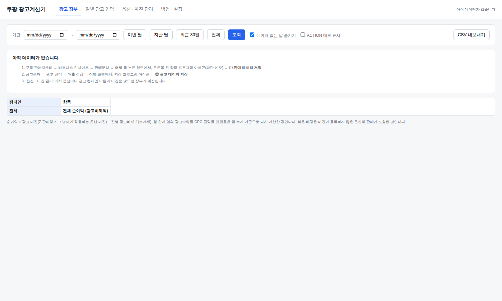
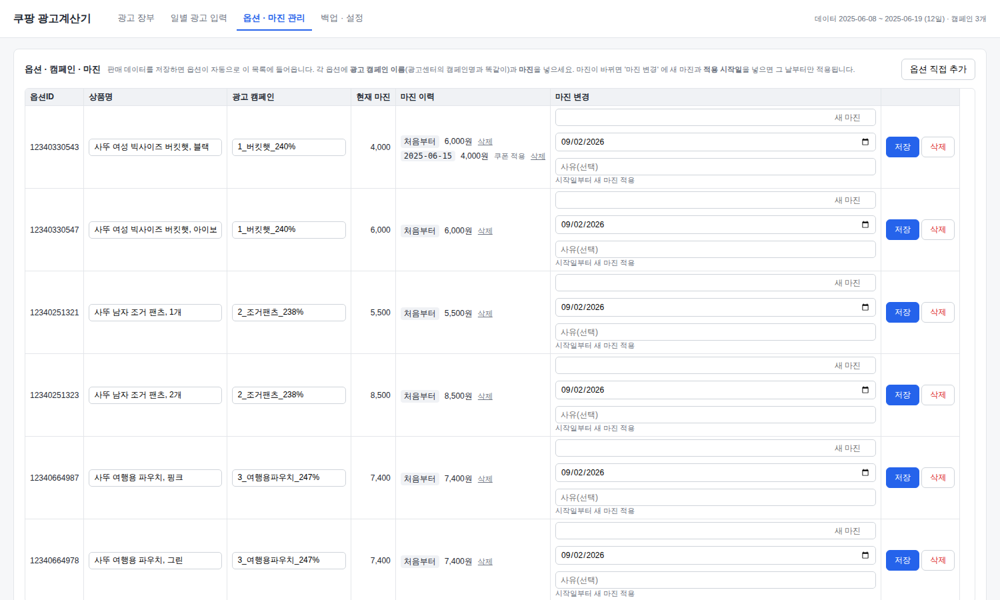
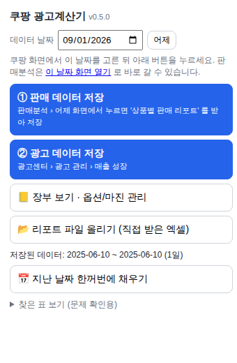
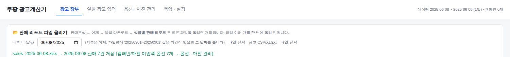
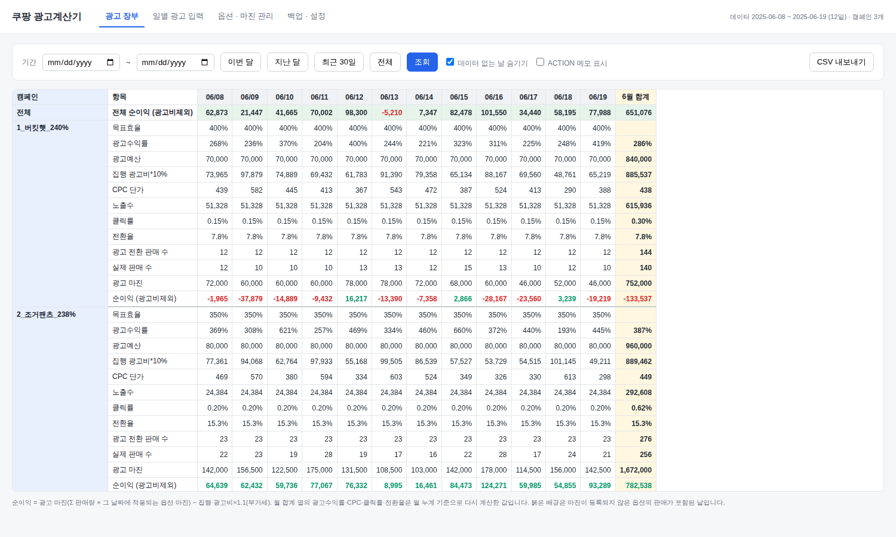
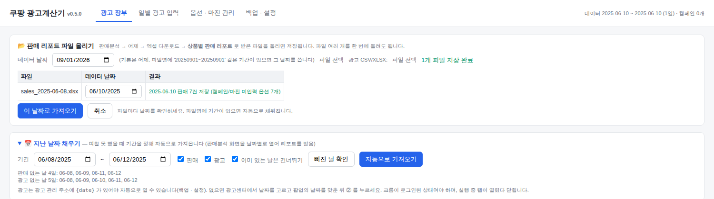
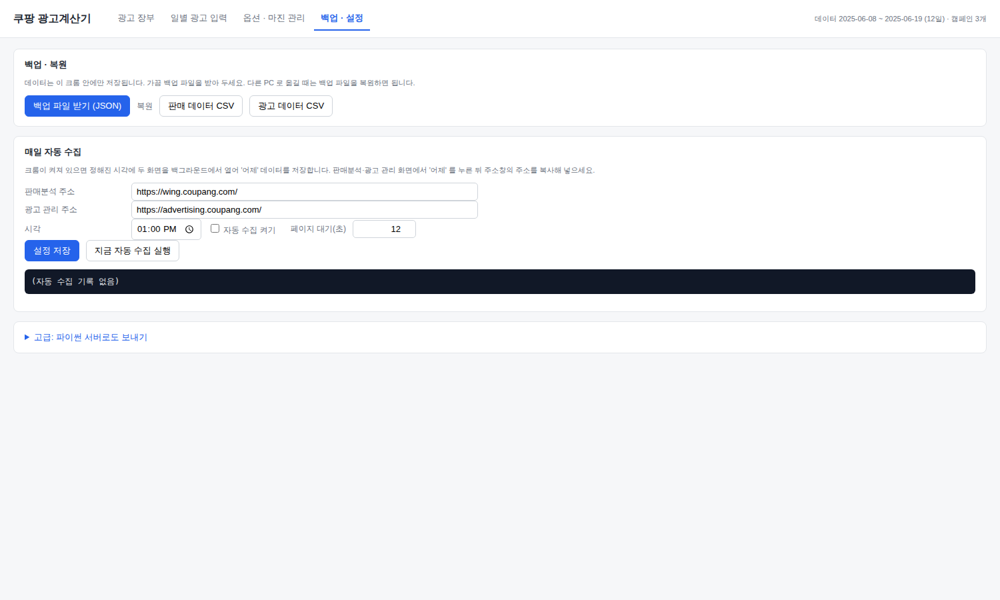
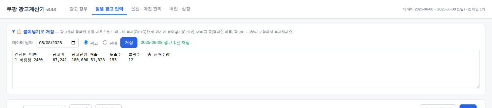

# 쿠팡 광고계산기 — 초보자 가이드 (설치 5분, 매일 1분)

프로그램 설치, 서버, 터미널 같은 것은 **전혀 필요 없습니다.**
크롬에 확장 프로그램 하나만 넣으면, 쿠팡 화면에서 버튼 두 번으로 어제 데이터가 저장되고 장부가 자동 계산됩니다.

---

## 1. 설치 (딱 한 번)

1. 이 저장소를 **Code → Download ZIP** 으로 받아 압축을 풉니다. (안에 `extension` 폴더가 있습니다)
2. 크롬 주소창에 `chrome://extensions` 를 입력하고 Enter.
3. 오른쪽 위 **개발자 모드** 스위치를 켭니다.
4. 왼쪽 위 **압축해제된 확장 프로그램을 로드합니다** 를 누르고, 압축을 푼 곳의 `extension` 폴더를 선택합니다.
5. 주소창 오른쪽 퍼즐 조각(🧩) 아이콘 → **쿠팡 광고계산기 수집기** 옆 📌 을 눌러 고정해 두면 편합니다.

설치가 끝나면 장부 화면이 자동으로 열립니다. (처음엔 비어 있는 게 정상입니다)

---

## 2. 처음 한 번: 옵션에 캠페인 이름과 마진 넣기

아래 3단계 "매일 하는 일" 로 **판매 리포트를 한 번 저장하면**, 옵션 목록이 자동으로 채워집니다. (판매분석의 옵션이 139개면 139개가 다 들어옵니다. 광고를 돌리는 옵션에만 캠페인 이름을 넣으면 되고, 나머지는 비워 둬도 됩니다)
그 다음 확장 아이콘 → **📒 장부 보기** → **옵션 · 마진 관리** 탭에서 옵션마다

- **광고 캠페인**: 광고센터에 있는 캠페인 이름을 똑같이 (예: `1_버킷햇_240%`)
- **마진**: 소싱계산기에서 계산한 옵션 마진 (원). 첫 마진은 "적용 시작일" 을 비워 두고 저장.

를 넣고 **저장** 을 누릅니다. 노란 줄은 아직 캠페인이나 마진이 비어 있는 옵션입니다.

---

## 3. 매일 하는 일 (오후 1시쯤, 1분)

1. 쿠팡 판매자센터 → **비즈니스 인사이트 → 판매분석 → 어제** 클릭
2. 확장 아이콘 → **① 판매 데이터 저장**
   - 확장 프로그램이 대신 **엑셀 다운로드 → 상품별 판매 리포트** 를 눌러 파일을 받고, 받은 파일을 읽어 저장합니다.
   - "저장 완료" 알림이 뜨면 끝. 알림이 안 오면 (쿠팡이 파일을 주는 방식에 따라 자동 읽기가 안 될 수 있습니다)
     확장 아이콘 → **📂 리포트 파일 올리기** 에서 방금 받은 파일(다운로드 폴더)을 고르면 됩니다.
   - 직접 엑셀 다운로드 → 상품별 판매 리포트 를 받아서 **📂 리포트 파일 올리기** 에 올려도 똑같습니다. 파일 여러 개를 한 번에 올려도 됩니다.
3. 광고센터 → **광고 관리 → 매출 성장 → 어제** 클릭
4. 확장 아이콘 → **② 광고 데이터 저장**

같은 날짜를 다시 저장하면 덮어쓰니(취소 반영 등) 걱정 없이 다시 해도 됩니다.
날짜는 파일명이나 화면에서 찾고, 못 찾으면 어제로 저장합니다. 다른 날짜 파일을 올릴 때는 "데이터 날짜" 칸을 바꿔 주세요.

---

## 4. 장부 보기

확장 아이콘 → **📒 장부 보기**. 캠페인별 × 날짜별로 목표효율, 광고수익률, 광고비, CPC, 노출·클릭·전환, 실제 판매 수, 광고 마진, **순이익** 이 나오고, 월 합계와 전체 순이익도 보입니다.

- **일별 광고 입력** 탭: 저장된 광고 숫자를 확인·수정하거나, 자동 저장이 안 된 날 직접 입력할 수 있습니다.
- **ACTION 메모**: 그 날 취한 조치를 적어 두면 장부에서 함께 볼 수 있습니다.

---

## 5. 마진이 바뀌었을 때 (가격 인하, 쿠폰)

**옵션 · 마진 관리** → 해당 옵션의 **마진 변경** 칸에 새 마진과 **적용 시작일** 을 넣고 저장.
시작일 **전날까지는 예전 마진**, 시작일부터는 새 마진으로 계산됩니다. 과거 장부는 바뀌지 않습니다.

---

## 6. 며칠 못 했을 때 — 지난 날짜 채우기

방법 A (자동): 확장 아이콘 → **📅 지난 날짜 한꺼번에 채우기** → 기간을 정하고 **빠진 날 확인** → **자동으로 가져오기**.
확장 프로그램이 날짜마다 판매분석 화면을 열어 리포트를 받아 저장하고 닫습니다. (크롬에 쿠팡 로그인이 되어 있어야 합니다)
광고는 광고 관리 주소에 `{date}` 가 있어야 자동으로 열 수 있습니다(백업 · 설정). 없으면 방법 B 로 하세요.

방법 B (수동): 팝업 맨 위 **데이터 날짜** 를 원하는 날로 바꾸고, **이 날짜 화면 열기** 를 누르면 그 날짜의 판매분석이 열립니다. 그 상태에서 ① 을 누르세요.
광고는 광고센터에서 그 날짜를 고른 뒤 팝업의 날짜가 맞는지 확인하고 ② 를 누르세요.

방법 C (파일): 리포트 파일을 여러 개 골라 **📂 리포트 파일 올리기** 에 올리면 파일마다 날짜를 확인하는 표가 나옵니다. 날짜를 맞춘 뒤 **이 날짜로 가져오기**.

자동 수집을 켜 두면 기본으로 **최근 7일 중 빠진 날**도 함께 채웁니다 (백업 · 설정에서 일수 조정).

## 7. 아예 자동으로 (선택)

**백업 · 설정** 탭에서
1. 판매분석 화면에서 "어제" 를 누른 뒤 주소창의 주소를 복사해 **판매분석 주소** 에 붙여넣기
2. 광고 관리 → 매출 성장에서 "어제" 를 누른 뒤 주소를 **광고 관리 주소** 에 붙여넣기
3. 시각(기본 13:00) 확인 → **자동 수집 켜기** 체크 → **설정 저장**

그 시각에 크롬이 켜져 있으면 스스로 두 화면을 열어 저장하고 닫습니다. (크롬이 꺼져 있었다면 **지금 자동 수집 실행** 을 누르면 됩니다)

---

## 새 버전으로 바꾸기
1. ZIP 을 다시 받아 압축을 풀고, 예전 `extension` 폴더를 새 폴더로 바꿉니다.
2. `chrome://extensions` → 쿠팡 광고계산기 카드의 **새로고침(↻)** 을 누릅니다.
3. 팝업 제목 옆의 버전(v0.4.0 처럼)이 바뀌었는지 확인합니다.

## 자주 묻는 것
- **"이 탭을 새로고침(F5)한 뒤 다시 눌러 주세요"** → 쿠팡 탭에서 F5 를 누르고 다시 ① 을 누르세요. (v0.4.0 부터는 대부분 자동으로 해결됩니다)

- **판매 데이터: "표를 찾지 못했습니다"** → 판매분석은 표가 아니라 엑셀 리포트로 저장합니다. ① 을 누르면 다운로드를 대신 눌러 주고, 안 되면 직접 받은 파일을 **📂 리포트 파일 올리기** 에 올리세요.
- **광고 데이터: "표를 못 읽었습니다"** → ② 가 다운로드 버튼을 대신 눌러 봅니다. 그래도 안 되면 광고센터 화면의 캠페인 표를 머리글부터 마우스로 드래그해 복사(Ctrl+C)하고, 장부 보기 → 일별 광고 입력 → **📋 붙여넣기로 저장** 에 붙여넣은 뒤 저장하세요. 팝업 아래 "찾은 표 보기" 내용을 보내 주시면 화면에 맞춰 드립니다.

- **데이터는 어디에?** → 이 크롬 안에 저장됩니다. 가끔 **백업 · 설정 → 백업 파일 받기** 로 파일을 받아 두세요. 다른 PC 에서는 그 파일로 **복원** 하면 됩니다.
- **엑셀로 보고 싶다** → 장부 화면의 **CSV 내보내기**, 백업 탭의 **판매/광고 데이터 CSV** 를 엑셀에서 열면 됩니다.
- **광고비가 0으로 저장됨** → 광고센터가 아직 어제 데이터를 갱신하기 전입니다. 나중에 다시 ② 를 누르세요.
